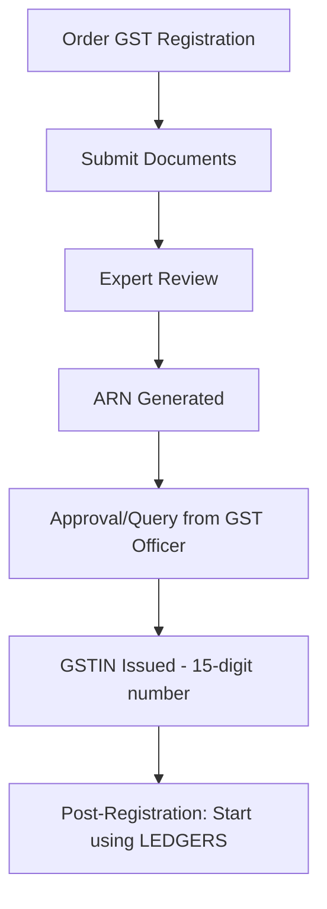
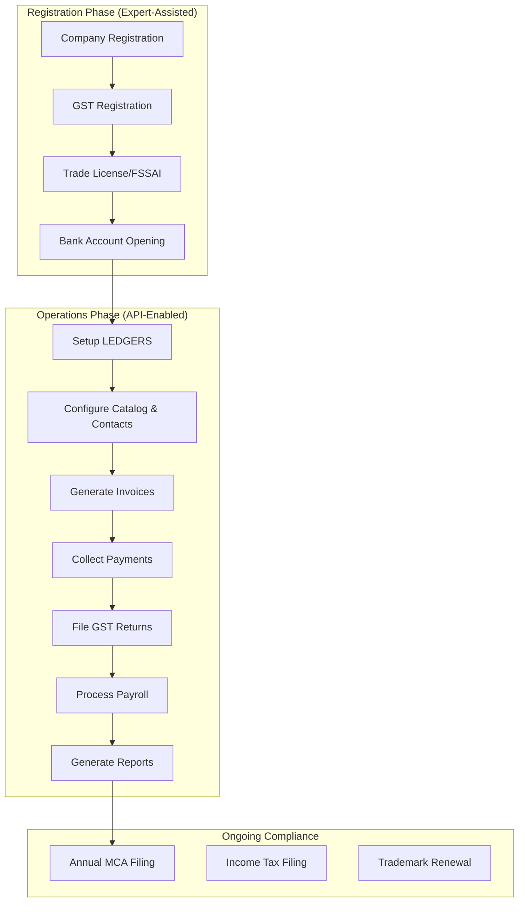

# IndiaFilings Platform & API Services Documentation

This walkthrough summarizes the comprehensive exploration of [IndiaFilings](https://www.indiafilings.com/) and their API platform **LEDGERS**.

## Platform Overview

**IndiaFilings** is India's largest AI-powered corporate services and compliance platform. It operates through two main components:

| Component | Purpose | Delivery Model |
|-----------|---------|----------------|
| **IndiaFilings (Professional Services)** | Business registration, compliance filings, legal services | Expert-assisted (not API-driven) |
| **LEDGERS (Software Platform)** | Post-registration operations: billing, GST, accounting, payroll | Web, Mobile Apps, **APIs** |

---

## Part 1: IndiaFilings Professional Services (No Public APIs)

> [!IMPORTANT]
> IndiaFilings' core registration services are **expert-assisted** and do NOT expose public APIs. They are human-driven workflows with online order placement.

### Business Registration Services

#### Entity Formation
| Service | Timeframe | User Journey |
|---------|-----------|--------------|
| Private Limited Company | ~10 days | Order → Submit docs → DSC/DIN → Name approval → SPICe+ filing → Incorporation |
| LLP Registration | ~15 days | Order → Partner DSC → LLPIN → Agreement filing |
| One Person Company (OPC) | ~10 days | Similar to Pvt Ltd with single director |
| Partnership Firm | ~7 days | Draft deed → Registration |
| Proprietorship | ~3 days | Documentation + GSTIN |

#### Key Steps in Company Registration Journey:
```
1. Select Package (Basic/Standard/Premium)
2. Submit KYC Documents (PAN, Aadhaar, Address proof)
3. Digital Signature Certificate (DSC) Generation
4. Director Identification Number (DIN) Application
5. Company Name Approval (RUN form)
6. SPICe+ Form Filing with MCA
7. Certificate of Incorporation Received
8. Post-incorporation: PAN, TAN, Bank Account, GST
```

### GST Registration Service

**GST Registration is a professional service** (not API) with the following journey:



**Documents Required:**
- PAN of business/owner
- Aadhaar of authorized signatory  
- Business address proof
- Bank statement/cancelled cheque
- Digital Signature (for companies/LLPs)
- Photographs

### Other Professional Services

| Category | Services |
|----------|----------|
| **Trademarks & IP** | Trademark Registration, Objection, Opposition, Renewal, Copyright, Patent |
| **Registrations** | FSSAI, Import-Export Code, MSME/Udyam, ESI, PF, Professional Tax |
| **Tax Filing** | Income Tax Returns, TDS Returns, 15CA-15CB |
| **Compliance** | Annual ROC Filing, DIR-3 KYC, DPT-3, MSME-1 |

---

## Part 2: LEDGERS API Platform

**LEDGERS** is IndiaFilings' software platform that **does expose APIs** for developers.

### API Documentation
- **API Reference**: [ledgers.readme.io/reference](https://ledgers.readme.io/reference)
- **Developers Page**: [ledgers.indiafilings.com/c/developers](https://ledgers.indiafilings.com/c/developers)

### API Service Categories

#### 1. Billing & Invoicing APIs
```
POST /contacts     - Create customer accounts
GET  /contacts     - List contacts
POST /quotes       - Create estimates/quotes  
POST /invoices     - Generate invoices (with GST)
GET  /invoices     - List invoices
POST /receipts     - Issue receipts
GET  /statements   - View account statements
```

**User Flow:**
```
Create Customer → Generate Quote → Convert to Invoice → 
Collect Payment → Issue Receipt → Reconcile
```

#### 2. GST Compliance APIs
| API | Purpose |
|-----|---------|
| **e-Invoice API** | Generate IRN, QR code for GST e-invoices |
| **e-Way Bill API** | Create e-way bills for goods transport |
| **GSTR-1 API** | File outward supplies return |
| **GSTR-3B API** | File summary return |
| **GSTN Sync API** | Direct data sync with government portal |
| **ITC Reconciliation** | Match input credits with 2A/2B |

**e-Invoice Generation Flow:**
```
Create Invoice in LEDGERS → API call to IRP → 
IRN + QR Generated → Invoice Signed → Share with Customer
```

#### 3. Payment Gateway APIs
- Integrate CCAvenue, RazorPay, EBS, ICICI Gateway
- Auto-embed payment links in invoices
- Real-time payment reconciliation
- Multi-gateway support for higher success rates

**Payment Collection Flow:**
```
Generate Invoice → Auto-embed Payment Link → 
Customer Pays (Card/UPI/NetBanking) → Auto-Receipt → 
Reconcile with Invoice → Update Receivables
```

#### 4. HR & Payroll APIs
```
POST /employees    - Add employee
PUT  /employees    - Update employee
GET  /employees    - List employees
POST /attendance   - Checkin/Checkout
POST /payroll/run  - Process payroll
POST /salary       - Configure salary structure
```

**Payroll Processing Flow:**
```
Setup Employee CTC → Configure Benefits/Deductions →
Mark Attendance → Run Payroll → Generate Payslips →
File TDS/ESI/PF → Pay Employees
```

#### 5. Verification APIs
| API | Purpose |
|-----|---------|
| **GSTIN Verification** | Validate GST registration |
| **PAN Verification** | Validate PAN details |
| **DIN Verification** | Director identification lookup |
| **Company Data** | MCA company information |
| **Trademark Search** | Brand availability check |

#### 6. Banking Integration
- Direct bank account access from LEDGERS
- Auto-fetch bank transactions
- Reconcile bank entries with invoices
- Multi-bank support (ICICI, AXIS, HDFC, etc.)

---

## Part 3: June AI - Compliance Co-Pilot

**June AI** is IndiaFilings' AI-powered compliance assistant:

### Capabilities
- Automated compliance monitoring (MCA, GST deadlines)
- Intelligent workflow automation
- Real-time filing status updates
- Error prevention in tax computations
- Digital document management

### Use Cases
- Auto-prepare GST returns from invoices
- Send compliance reminders
- Generate financial reports on demand
- Auto-reconcile payments and invoices

---

## User Journey Summary

### Complete Business Lifecycle on IndiaFilings + LEDGERS



---

## Key Takeaways

| Question | Answer |
|----------|--------|
| Does IndiaFilings offer GST Registration API? | ❌ No - Expert-assisted service |
| Does IndiaFilings offer Company Registration API? | ❌ No - Expert-assisted service |
| Can I automate GST filing via API? | ✅ Yes - via LEDGERS APIs |
| Can I automate invoicing via API? | ✅ Yes - via LEDGERS APIs |
| Can I verify GSTIN/PAN programmatically? | ✅ Yes - via LEDGERS Verification APIs |
| Can I process payroll via API? | ✅ Yes - via LEDGERS HR APIs |

---

## Resources

| Resource | URL |
|----------|-----|
| IndiaFilings Main Site | [indiafilings.com](https://www.indiafilings.com/) |
| LEDGERS Platform | [ledgers.indiafilings.com](https://ledgers.indiafilings.com/) |
| LEDGERS API Docs | [ledgers.readme.io/reference](https://ledgers.readme.io/reference) |
| LEDGERS Developers | [ledgers.indiafilings.com/c/developers](https://ledgers.indiafilings.com/c/developers) |
| GST Software | [indiafilings.com/gst-software](https://www.indiafilings.com/gst-software) |
